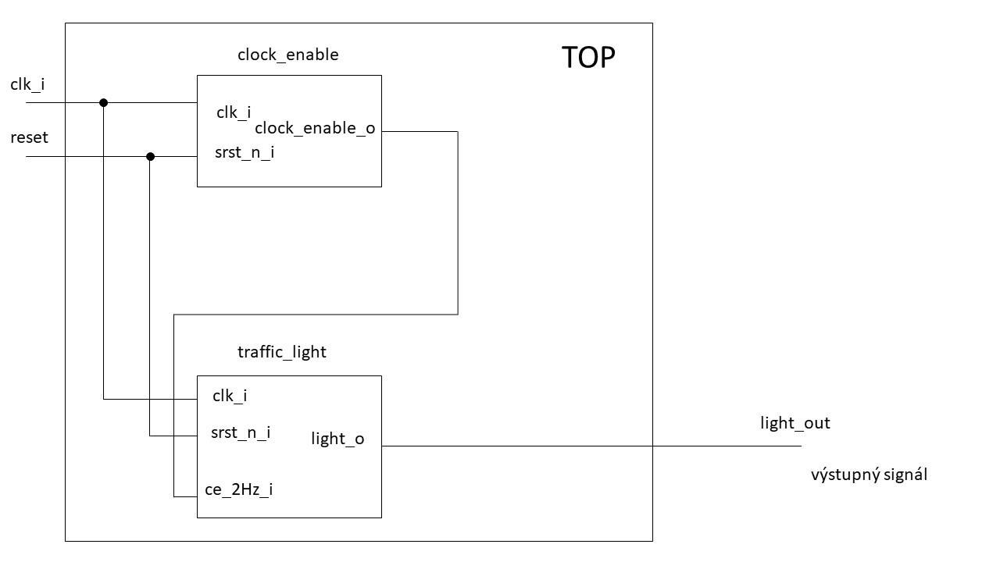

# Lab 8: Traffic light controller

#### Objectives

In this laboratory exercise you will implement a finite state machine, specifically a traffic light controller at a junction. You will use the Xilinx Isim simulator or the EDA playground online tool. You will use a push button on the CoolRunner board as reset device, onboard clock signal with frequency of 10&nbsp;kHz for synchronization, and CPLD expansion board LEDs as outputs.

[Video](https://youtu.be/P2emiQeBgE8)

## 1 Synchronize Git and create a new folder

Synchronize the contents of your Digital-electronics-1 working directory with GitHub. and create a new folder `Labs/08-traffic_lights`.

## 2 Finite State Machine (FSM)

A finite state machine (FSM) is a computation model that can be implemented with hardware or software and can be used to simulate sequential logic. There are two different main types of finite state machines: the Mealy FSM and the Moore FSM. The fundamental difference between these two types lies in the management of the outputs:

* The output of the Mealy FSM depends on the present state and inputs.
* The outputs of a Moore machine depend only on the present state and not on the inputs.

Read the article [Implementing a Finite State Machine in VHDL](https://www.allaboutcircuits.com/technical-articles/implementing-a-finite-state-machine-in-vhdl/) and understand how to design your own FSM. How you can define your own data type in VHDL? Give an example.

## 3 Traffic light controller

For simulation files see `result_traffic_lights` folder or simulation in [EDAPlaygrounds](https://www.edaplayground.com/x/3mqz)

## 4 Traffic light simulation

## 5 Top level

