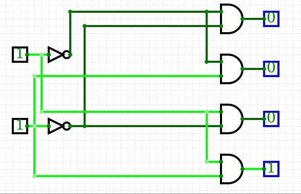
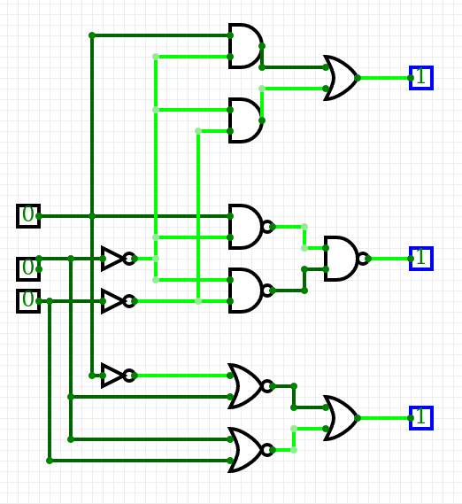

  | **A** | **NOT** |
  | :-: | :-: |
  | 0 | 1 |
  | 1 | 0 |

  | **A** | **B** | **AND** | **NAND** |
  | :-: | :-: | :-: | :-: |
  | 0 | 0 | 0 | 1 |
  | 0 | 1 | 0 | 1 |
  | 1 | 0 | 0 | 0 |
  | 1 | 1 | 1 | 1 |

  | **A** | **B** | **OR** | **NOR** |
  | :-: | :-: | :-: | :-: |
  | 0 | 0 | 0 | 1 |
  | 0 | 1 | 1 | 0 |
  | 1 | 0 | 1 | 0 |
  | 1 | 1 | 1 | 0 |

  | **A** | **B** | **XOR** | **XNOR** |
  | :-: | :-: | :-: | :-: |
  | 0 | 0 | 0 | 1 |
  | 0 | 1 | 1 | 0 |
  | 1 | 0 | 1 | 0 |
  | 1 | 1 | 0 | 1 |
  
 

  | **A** | **B** |**C** | f | *f*AND | *f*OR |
  | :-: | :-: | :-: | :-: | :-: | :-: |
  | 0 | 0 | 0 | 1 | 1 | 1 |
  | 0 | 0 | 1 | 0 | 0 | 0 |
  | 0 | 1 | 0 | 0 | 0 | 0 |
  | 0 | 1 | 1 | 0 | 0 | 0 |
  | 1 | 0 | 0 | 1 | 1 | 1 |
  | 1 | 0 | 1 | 1 | 1 | 1 |
  | 1 | 1 | 0 | 0 | 0 | 0 |
  | 1 | 1 | 1 | 0 | 0 | 0 |

  | **A** | **B** | **Q3** | **Q2** | **Q1** | **Q0** |
  | :-: | :-: | :-: | :-: | :-: | :-: |
  | 0 | 0 | 0 | 0 | 0 | 1 |
  | 0 | 1 | 0 | 0 | 1 | 0 |
  | 1 | 0 | 0 | 1 | 0 | 0 |
  | 1 | 1 | 1 | 0 | 0 | 0 |

