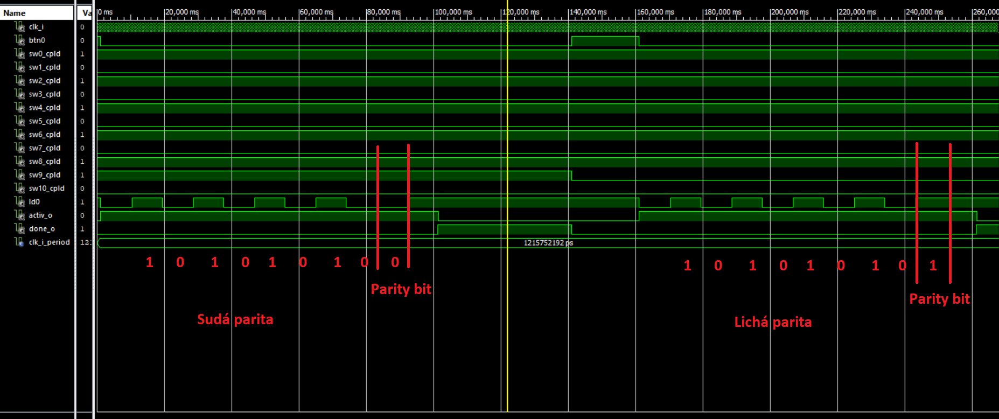
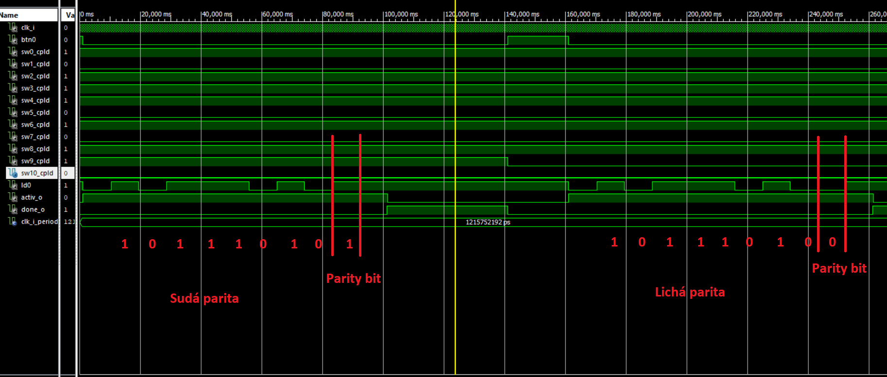
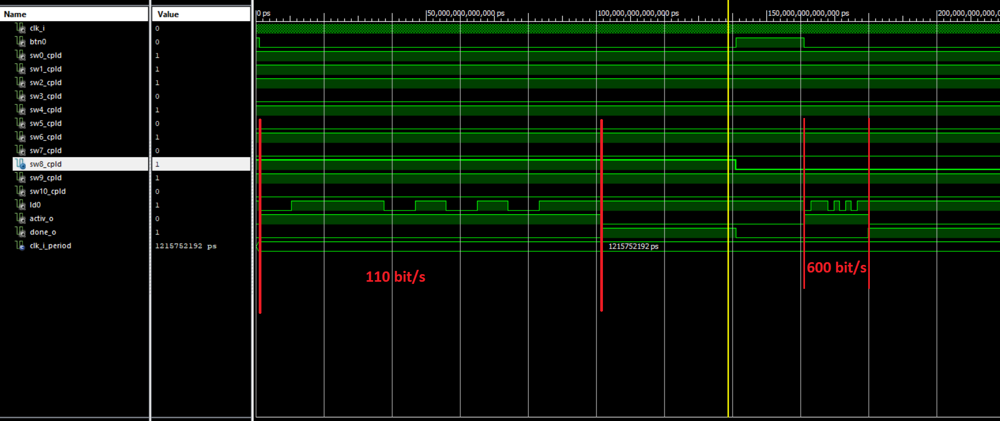
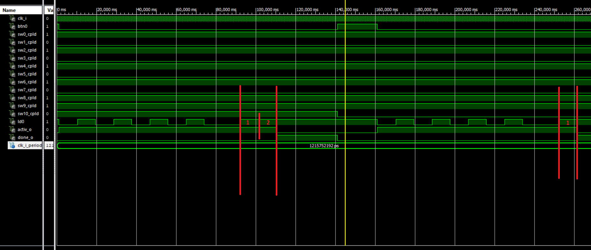
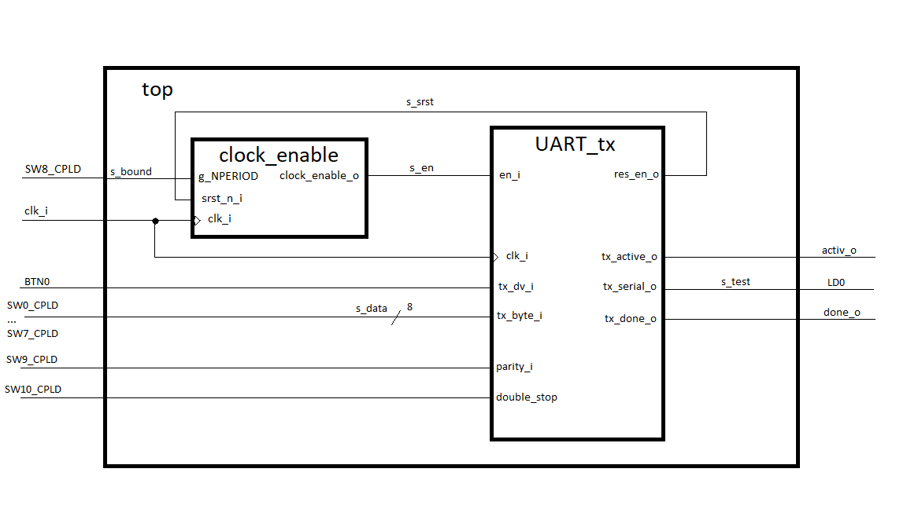

## Popis zadanej problematiky

* UART (universal asynchronous receiver-transmitter) je hardwarové zariadenie pre asynchrónnu komunikáciu, pri ktorej je možné meniť rýchlosť a formát dát. Vysielač posiela byty po  jednotlivých bitoch v konkrétnom poradí: start bit, jednotlivé bity dát (od 5 do 9 bitov), parity bit, stop bit (jeden alebo viacero). Start a stop bit slúžia na identifikáciu začiatku a konca správy a parity bit slúži na kontrolu integrity správy. Pri nečinnosti je úroveň signálu v log. 1, následne start bit je log. 0 a stop bit je znova log. 1, tým sa zabezpečilo, že dôjde aspoň k jednej zmene úrovne signálu. Podobný systém je použitý pri RS-232 porte.

* Pri úlohe sme na clockovací signál použili dávnejšie vytvorený clock_enable.vhd. Hlavnú časť projektu UART_tx sme riešili pomocou case sekvencie, kde každá časť rieši iný problém ako napr. passive state, start bit, parity bity, stop bity, začiatok vysielania dát, počítanie indexov, clean process. Počet data bitov sme zvolili 8. Hodnota dát a volba rýchlosti, parity a double stop bitov je riešená pomocou switchov implementovaných na doske. Spúšťačom je button, po ktorého stlačení sa odošle navolená správa (reakcia sa vyvoláva log 0). V top module prepájame jednotlivé časti nášho projektu a zároveň sa tu určujú dve rýchlosti medzi ktorými bude možné prepínať.

## Legenda

* clk_i 	- hodinový signál
* BTN0	- slúži na spustenie procesu, pri stlačení = log. 0
* SW0_CPLD – SW7_CPLD – zvolenie hodnoty jednotlivých bitov
* SW8_CPLD	- slúži na určenie rýchlosti, log. 1 = 110 bit/s, log. 0 = 600 bit/s
* SW9_CPLD	- slúži na určenie parity, log. 1 = sudá parita, log. 0 = lichá parita
* SW10_CPLD	- slúži na určenie stop bitu, log. 1 = dva stop bity, log. 0 = jeden stop bit
* LD0	- slúži iba na kontrolu signálu pri simulácii (pri reálnom prevedení nepoužitá)
* active_o  - určuje dobu, počas ktorej sa vysiela správa
* done_o  - určuje dobu, po odvysielaní správy

## Parita sudá/lichá

* Na nasledujúcich obrázkoch je vidieť meniaci sa parity bit pri prechode zo sudej parity na lichú pri rôznych počtoch jednotiek.

&nbsp;

## Rýchlosť

* Rýchlosť je možné voliť medzi hodnotami 110 bit/s a 600 bit/s, ako je aj vidieť.

## Dvojitý stop bit

* Pridali sme možnosť zvoliť si medzi jedným alebo dvoma stop bitmi, s ktorou sme sa stretli pri študovaní problematiky.
Určiť počet stop bitov môžeme pri porovnaní signálu s hladinou active.

&nbsp;
## Schéma obvodových zapojení

&nbsp;
## Odkazy na zdrojové súbory
* [top](UART/top.vhd)
* [testbench](UART/testbench.vhd)
* [clock_enable](UART/clock_enable.vhd)
* [UART](UART/UART_tx.vhd)

&nbsp;
## Zdroje
* <https://en.wikipedia.org/wiki/Universal_asynchronous_receiver-transmitter>

* <https://www.nandland.com/vhdl/modules/module-uart-serial-port-rs232.html>

* <https://electronics.stackexchange.com/questions/9264/what-standard-uart-rates-are-there>
