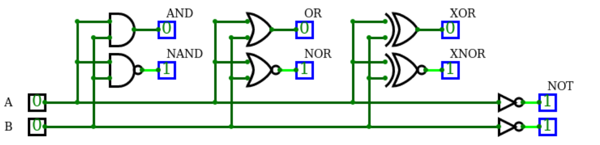
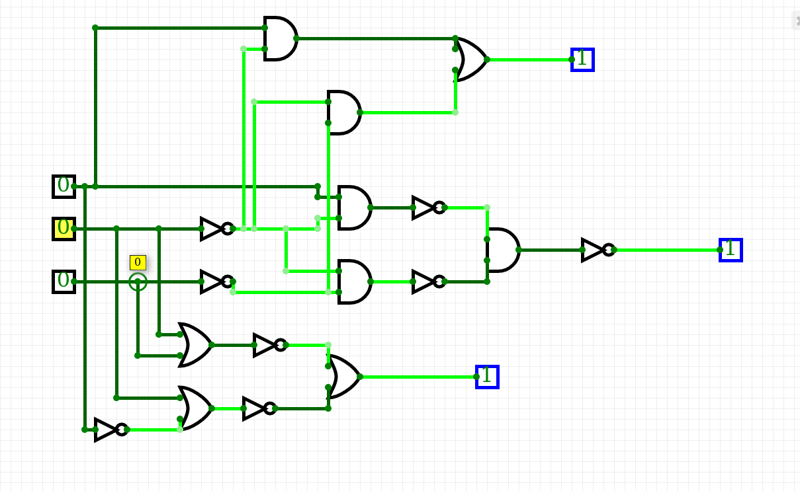
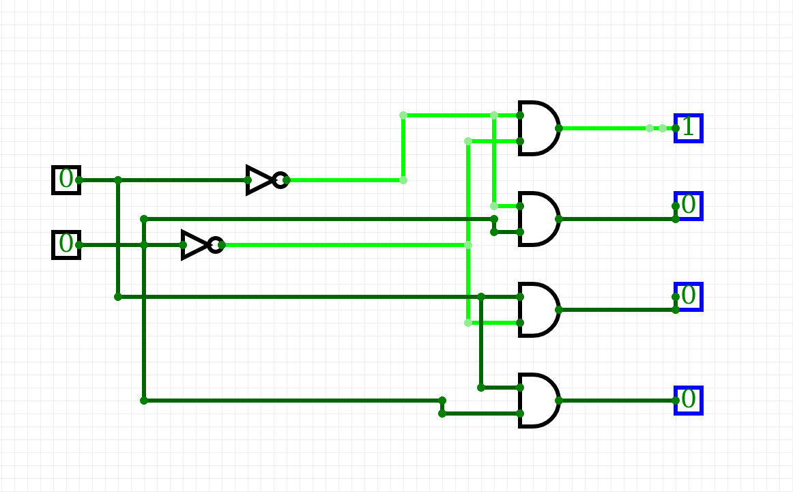

# Simulace Gaty 

| **A** | **NOT** |
| :-: | :-: |
| 0 | 1 |
| 1 | 0 |

| **A** | **B** | **AND** | **NAND** |
| :-: | :-: | :-: | :-: |
| 0 | 0 | 0 | 1 |
| 0 | 1 | 0 | 1 |
| 1 | 0 | 0 | 1|
| 1 | 1 | 1 |  0|

| **A** | **B** | **OR** | **NOR** |
| :-: | :-: | :-: | :-: |
| 0 | 0 | 0 | 1 |
| 0 | 1 | 1 | 0 |
| 1 | 0 | 1 | 0 |
| 1 | 1 | 1 | 0 |

| **A** | **B** | **XOR** | **XNOR** |
| :-: | :-: | :-: | :-: |
| 0 | 0 | 0 | 1 |
| 0 | 1 | 1 | 0 |
| 1 | 0 |  1| 0 |
| 1 | 1 | 0 | 1 |

# De Morgans 

## Schéma

## Tabulka

| **A** | **B** |**C** |  |  |  |
| :-: | :-: | :-: | :-: | :-: | :-: |
| 0 | 0 | 0 | 1| 1|1 |
| 0 | 0 | 1 | 0| 0| 0|
| 0 | 1 | 0 |0 | 0| 0|
| 0 | 1 | 1 | 0| 0| 0|
| 1 | 0 | 0 | 1| 1|1 |
| 1 | 0 | 1 | 1| 1| 1|
| 1 | 1 | 0 | 0| 0| 0|
| 1 | 1 | 1 | 0| 0| 0|

# Navíc

## Schéma

## Tabulka

| **A** | **B** | **Q3** | **Q2** | **Q1** | **Q0** |
| :-: | :-: | :-: | :-: | :-: | :-: |
| 0 | 0 | 0 | 0 |0|1|
| 0 | 1 | 0 | 0 |1|0|
| 1 | 0 | 0 | 1 |0|0|
| 1 | 1 | 1 | 0 |0|0|

Obvod funguje jako adresovač 2 bitový. Součást Multiplexoru.
