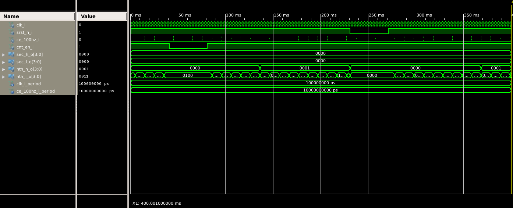

# Projekt stop watch

## Blokové schéma modulu TOP

## Simulace bloku StopWatch

Ukázka funkce zapnutí vypnutí čítání a synchronního resetu.

Ukázka vynulování posledního čítače po 60s. Odchylka od časové osy 60 s je způsobená vynulováním čítače v průběhu simulace, pro ukázku resetu.
# Implementace na Altera Cyclone IV E
Pro lepší vizualizaci a kontrolu byla provedena implementace na vývojové desce s FPGA Altera Cyclone IV E. Viz složka counter. Zde soubor counter.vhd lze považovat za TOP modul, nicméně vstupy a výstupy mají jiné názvy z pochopitelných důvodů než pro desku COOLRUNNER. Stejně tak neodpovídají hodnoty pro čítače clock_enable, jelikož je na této desce fixní frekvence CLK 48 MHz. Stejně tak muselo být upraveno řízení sedmi segmentového displaye.

## Blokové schéma

