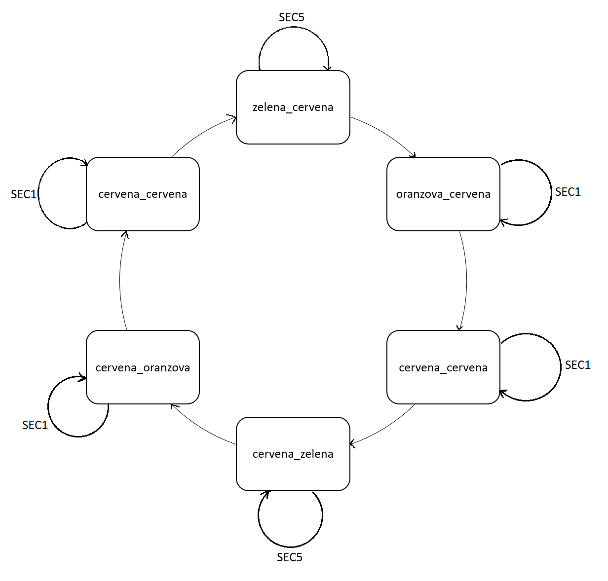
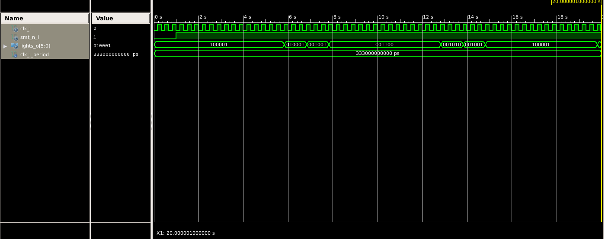
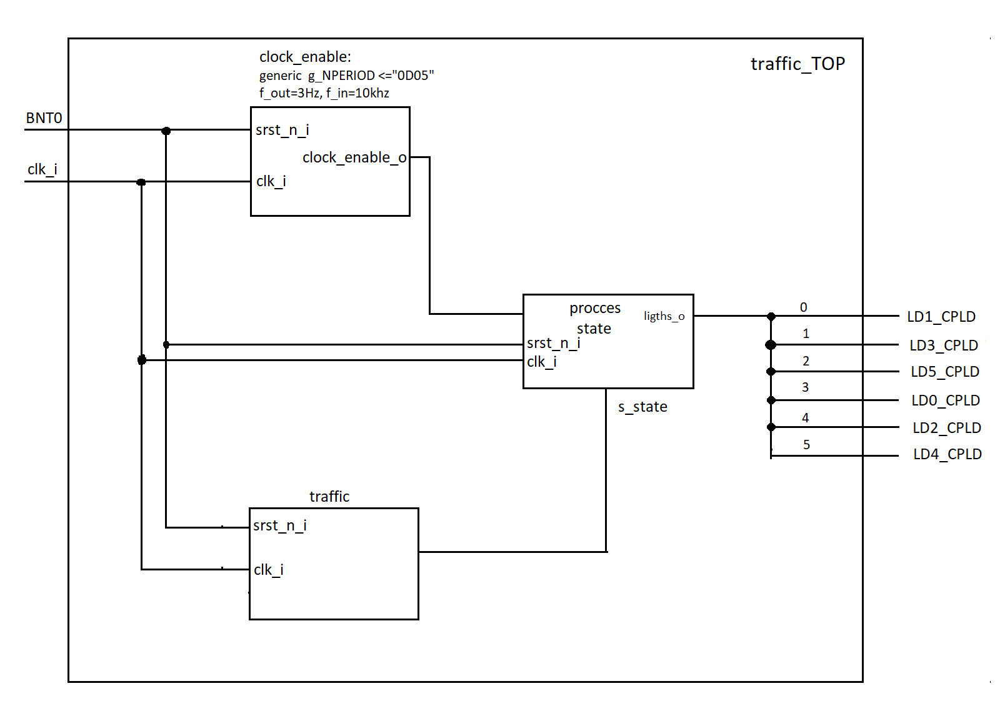

# Diagram FSM

Vlastní datové typy zle definovat následovně:
TYPE muj_typ IS ('A', '1', 'V');
pak tento datový typ může nabývat hodnot A 1 V, následně je pak třeba těmto hodnotám přiřadit určité úkony, jako přiřadit výstupní signály.
Také je možné například definovat podtypy již existujících datových typů
TYPE cele_male_cislo is range -8 to 8;

# Simulace

Na začátku je po 1 sekundu aktivovaný reset, tudíž dojde k protažení bloku kdy jsou semafory ve stavu zelená-červená.

# Blokové schéma TOP implementace

