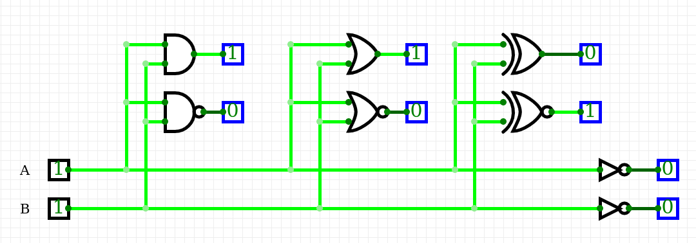
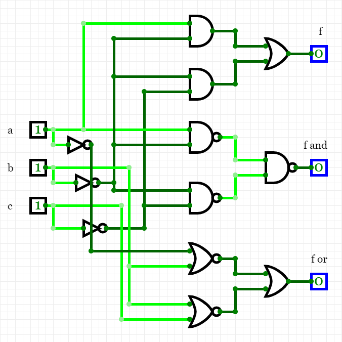

# CircuitVerse simulation - basic logic gates
A screenshot of our simulation schematic.

# Basic logic gates table

| **A** | **B** | **AND** | **NAND**| **OR** | **NOR** | **XOR** | **XNOR** | **NOT**(A) |
| :-: | :-: | :-: | :-: | :-: | :-: | :-: | :-: | :-: |
| 0 | 0 | 0 | 1 | 0 | 1 | 0 | 1 | 1 |
| 0 | 1 | 0 | 1 | 1 | 0 | 1 | 0 | 1 |
| 1 | 0 | 0 | 1 | 1 | 0 | 1 | 0 | 0 |
| 1 | 1 | 1 | 0 | 1 | 0 | 0 | 1 | 0 |

# Verifying DeMorgan's law

Now we try to verify DeMorgan's law by running these equations (original *f* and its substitutes)

in CircruitVerse simulation.

# Simulation - DeMorgan's law

