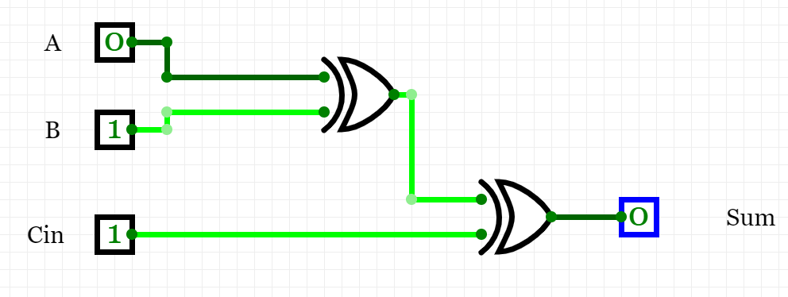
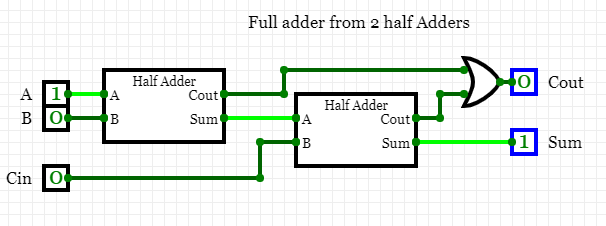

## Half adder truth table and logic diagram

| **B** | **A** | **Carry** | **Sum** |
| :-: | :-: | :-: | :-: |
| 0 | 0 | 0 |  0|
| 0 | 1 | 0 | 1 |
| 1 | 0 | 0 | 1 |
| 1 | 1 | 1 | 0 |

## Full adder truth table and logic diagram

| **Cin** | **B** | **A** | **Cout** | **Sum** |
| :-: | :-: | :-: | :-: | :-: |
| 0 | 0 | 0 | 0 | 0 |
| 0 | 0 | 1 | 0 | 1 |
| 0 | 1 | 0 | 0 | 1 | 
| 0 | 1 | 1 | 1 | 0 |
| 1 | 0 | 0 | 0 | 1 |
| 1 | 0 | 1 | 1 | 0 |
| 1 | 1 | 0 | 1 | 0 |
| 1 | 1 | 1 | 1 | 1 |

## Relationship between half adder and full adder logic diagram

