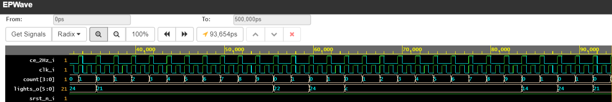
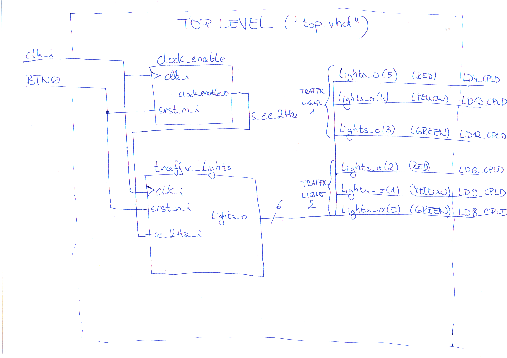
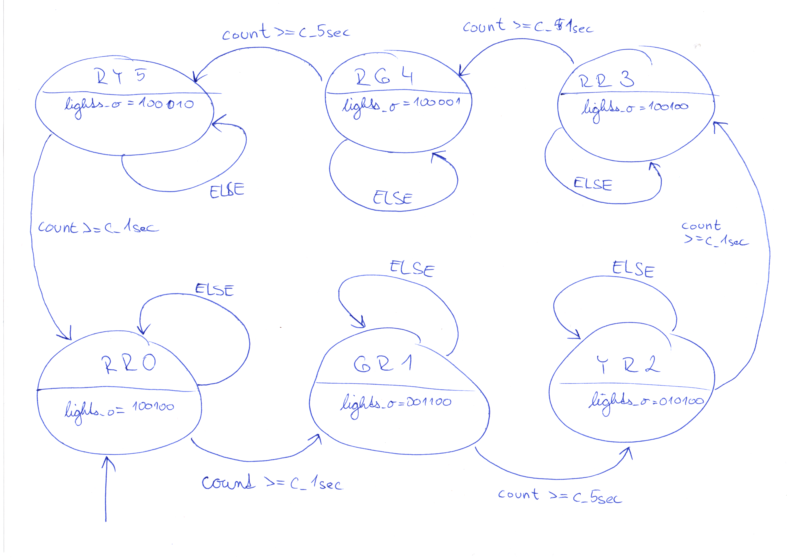

# Solution
Added files from EDA playground to this file. To go  to said playground [click here](https://www.edaplayground.com/x/mFE).
The 3 Hz signal used in the instructional video had to be changed to 2 Hz because the clock_enable entity is not able to reliably create a 3 Hz signal from a 10 kHz clock.

## Variable type declaration in VHDL
To declare a new variable type one uses the command: **type [variable-type-name] is ([list of possible states]);** as shown in the following screenshot from the vhd file of the **traffic_lights** entity

## Simulation
Simulation of traffic light system for simple 2 one-way intersection. Due to the used simulator it is not possible to break down the logic vector lights_o, so here is a key:
* state RR0: red - red, lights_o = 0b100100 = 0x24
* state GR1: green - red, lights_o = 0b0011000 = 0xc
* state YR2: yellow - red, lights_o = 0b010100 = 0x14
* state RR3: red - red, lights_o = 0b100100 = 0x24
* state RG4: red - green, lights_o = 0b100001 = 0x21
* state RY5: red - yellow, lights_o = 0b100010 = 0x22

So the correct cycle is 24 -> c -> 14 -> 24 -> 21 -> 22 -> 24 -> ... in hexadecimal notation.

## Top level implementation

## State diagram of implemented FSM

