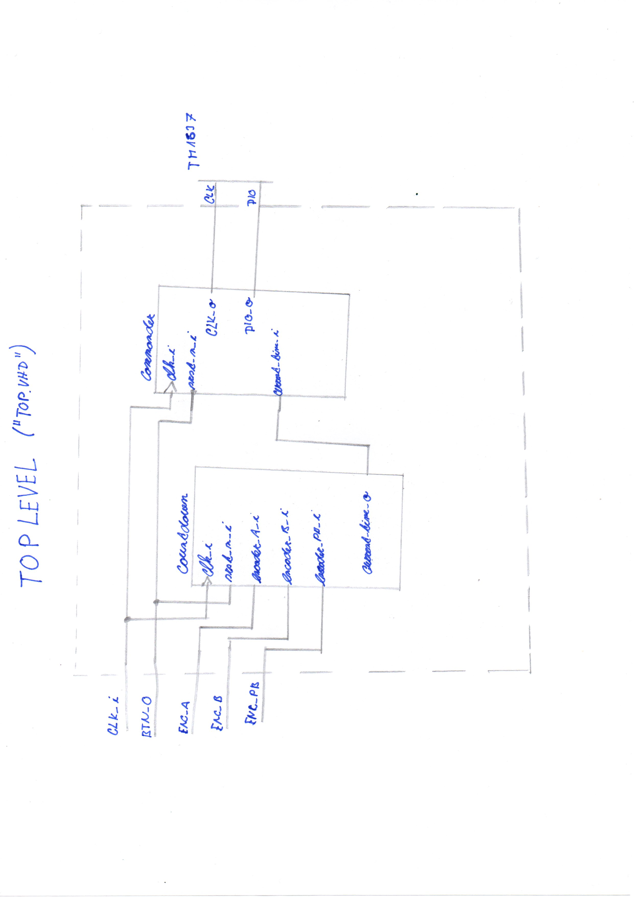
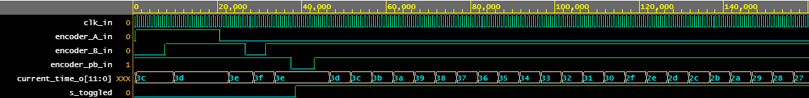
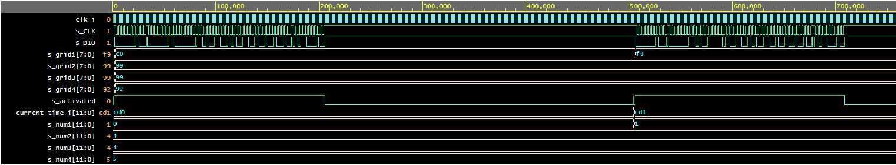
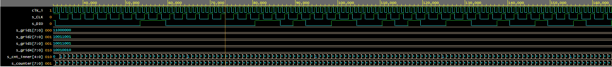

# Assignment 
Countdown (from set value to zero) with rotary encoder KY-040 (with implemented push button) and integrated circuit TM1637 for communication with seven segment display.

The time can be set up to 59 min 59 sec. After reaching zero, it stays there for 5 seconds, then resets to setting mode with 1 minute preset.

# Top implementation
The inputs for our top implementation are three pins from the rotary encoder (A, B, push button), a clock signal with a frequency of 10 kHz and a button as synchronous reset. The outputs are CLK and DIO used for the IC TM1637. Both the encoder and the IC need their own power supply.

note: the .ucf file that would be normally used is in the form of a text file in this project folder

# Countdown module
This module implements all the logic for setting and counting down time, which is then output in the form of a 12bit number.

Clockwise rotation for increasing, counter clockwise rotation for decreasing set value.

The simulation files are in their corresponding folder, they can be also found in [this EDAplayground](https://www.edaplayground.com/x/4qsw).

# Commander

This module's main input is the current time number from the countdown module. If a change is detected, the new time is transformed into the minutes : seconds format. With this format a command sequence using the CLK and DIO outputs can be formed.

We use the adress auto increment 1 mode mentioned in its documentation.

The simulation files are in their corresponding folder, they can be also found in [this EDAplayground](https://www.edaplayground.com/x/3wju).

